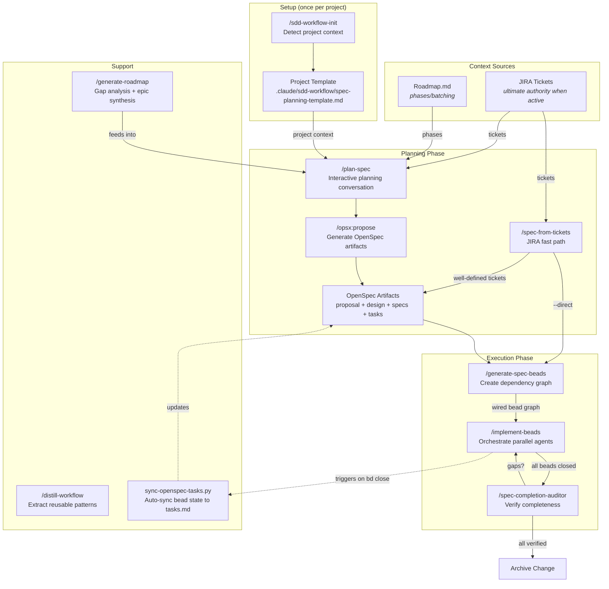
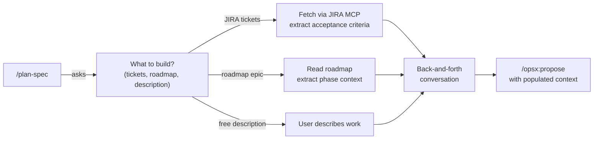
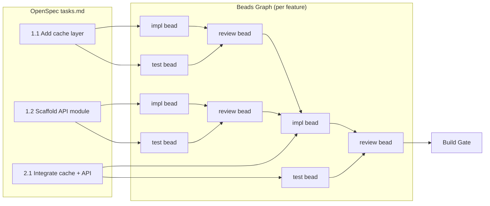
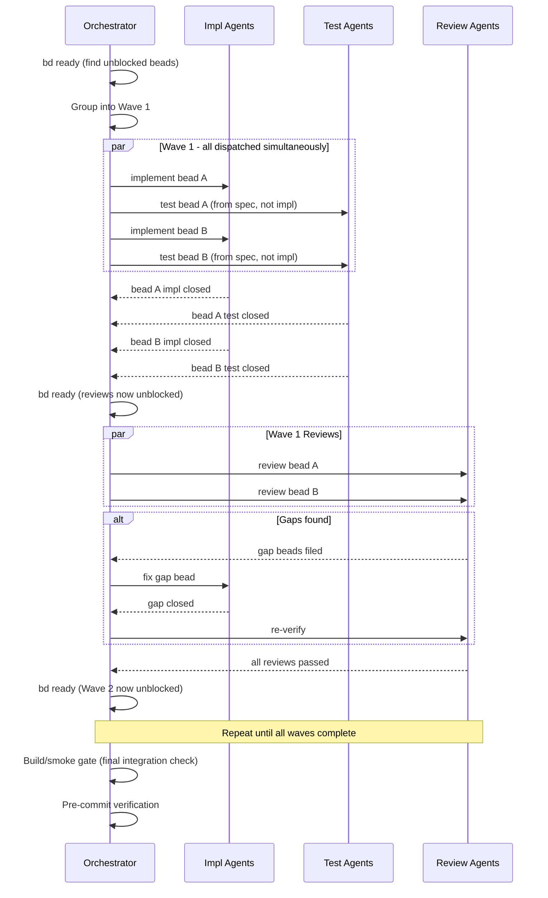
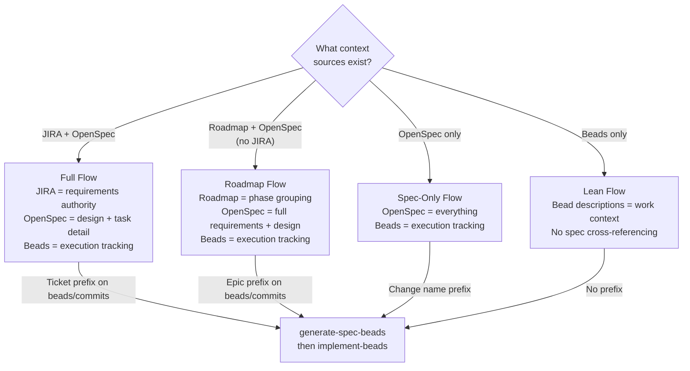

# SDD-Workflow: Spec-Driven Development for AI Agents

A Claude Code plugin that orchestrates the full lifecycle of spec-driven development — from requirements gathering through implementation, review, and verification — using AI agents coordinated by a dependency-aware task graph.

## The Core Idea

Instead of giving an AI agent a vague prompt and hoping for the best, this workflow:

1. **Plans rigorously** — requirements, design decisions, acceptance criteria
2. **Decomposes into a dependency graph** — each unit of work is a tracked "bead" with clear inputs, outputs, and dependencies
3. **Executes with parallel agents** — an orchestrator dispatches specialized agents (implementation, testing, review) that work concurrently
4. **Gates quality at every stage** — per-feature review agents verify work before downstream tasks begin

The result: auditable, parallelized, spec-compliant implementation with full traceability from requirements to code.

## How It Fits Together



## Workflow Stages

### Stage 0: Project Setup (`/sdd-workflow-init`)

Run once per project. Scans the codebase — README, CLAUDE.md, dependency files, test infrastructure, CI config — and creates a **project-specific planning template** at `.claude/sdd-workflow/spec-planning-template.md`. This template pre-populates domain context, toolchain commands, quality requirements, and architectural patterns so every planning session starts with accurate project context.

### Stage 1: Planning

Two paths into planning, depending on how well-defined the work is:

| Path | Skill | When to use |
|------|-------|-------------|
| **Interactive** | `/plan-spec <change-name> [PROJ-123 ...]` | Default. Drives a back-and-forth conversation: gathers context, fetches JIRA tickets, researches the codebase, aligns on design, then invokes `/opsx:propose`. |
| **Fast path** | `/spec-from-tickets PROJ-123 PROJ-456` | JIRA tickets are well-defined with clear acceptance criteria. Assesses ticket quality, generates minimal OpenSpec artifacts (or `--direct` to beads). |

Both paths produce **OpenSpec artifacts** (proposal, design, specs with acceptance scenarios, ordered tasks) that feed into bead generation.



**The back-and-forth conversation IS the product.** The interactive planning dialog catches misunderstandings that would otherwise become expensive bugs during implementation. `/plan-spec` structures this conversation, not replaces it.

### Stage 2: Bead Generation (`/generate-spec-beads`)

Converts the planned tasks into a **dependency-wired Beads graph** — the execution plan.



**Key structural pattern — the per-feature triad:**
- **Impl bead** + **Test bead** are independent (no dependency between them)
- **Review bead** depends on both completing
- Downstream work depends on the **review bead**, not the impl bead directly

This structure enables maximum parallelism while ensuring nothing proceeds without review.

### Stage 3: Implementation (`/implement-beads`)

The orchestrator agent reads the bead graph and executes it in parallel waves:



**Three agent roles:**

| Role | What it does | Key constraint |
|------|-------------|----------------|
| **implementation-agent** | Writes production code for one bead | Follows design decisions; flags deviations |
| **test-writer-agent** | Writes tests from spec/acceptance criteria | Never reads implementation code; tests define the contract |
| **review-agent** | Verifies impl + tests against spec | Files gap beads for issues; never fixes them directly |

### Stage 4: Verification (`/spec-completion-auditor`)

After all beads are closed, the auditor cross-checks:
- Every closed bead has a corresponding completed spec task
- Every completed spec task has a closed bead backing it
- The actual source code implements what the bead claims

Produces a structured report with auto-synced tasks, gaps, and archive readiness.

## Quick Reference

### Installation

```bash
# In Claude Code
/plugin marketplace add <org>/sand2silicon-agentic-skills
/plugin install sdd-workflow --scope project
```

### Skill Commands

| Skill | Invocation | When to use |
|-------|-----------|-------------|
| `sdd-workflow-init` | `/sdd-workflow-init` | Once per project; creates project-specific planning template |
| `plan-spec` | `/plan-spec <change-name> [tickets...] [--epic N]` | Starting new work; interactive planning with context gathering |
| `spec-from-tickets` | `/spec-from-tickets PROJ-123 [...]  [--direct]` | JIRA tickets are well-defined; fast path to specs or beads |
| `generate-spec-beads` | `/generate-spec-beads <change-name>` | After planning; creates the bead dependency graph |
| `implement-beads` | `/implement-beads <change-name or epic-id>` | After beads exist; drives parallel implementation |
| `spec-completion-auditor` | Invoked automatically at end of `/implement-beads`, or manually | After implementation; verifies completeness |
| `generate-roadmap` | `/generate-roadmap` | Before planning; analyzes project state and generates phased epics |
| `distill-workflow` | `/distill-workflow` | After a productive session; extracts reusable patterns |

### Typical Session

```bash
# 0. One-time project setup
/sdd-workflow-init

# 1. Plan interactively (or /spec-from-tickets for well-defined JIRA tickets)
/plan-spec add-auth-middleware PROJ-123 PROJ-456

# 2. Generate beads from the completed OpenSpec change
/generate-spec-beads add-auth-middleware

# 3. Implement (will ask: worktree or current branch?)
/implement-beads add-auth-middleware

# 4. If auditor reports all clear, archive
/openspec-archive-change add-auth-middleware
```

## Template Architecture

The planning template follows a three-tier pattern:

```
Base template (in plugin)
  templates/spec-planning-template.md
  Generic structure, reusable process instructions
      │
      ▼
Project template (per project, generated by /sdd-workflow-init)
  .claude/sdd-workflow/spec-planning-template.md
  Pre-filled domain context, toolchain, conventions
      │
      ▼
Per-change copy (optional, via new-plan.sh)
  <change-name>-plan.md
  Filled in for a specific body of work
```

- `/plan-spec` reads the project template automatically (falls back to base)
- `scripts/new-plan.sh <change-name>` copies the template for offline editing
- Edit the project template freely — it's yours to customize

## Context Source Flows

The workflow adapts based on which context sources are available:



**JIRA is always the ultimate authority when active.** If a spec and JIRA acceptance criteria conflict, JIRA wins. OpenSpec expands on JIRA with design detail and task decomposition. A roadmap, when present alongside JIRA, is just an organizational bridge for batching tickets into planning phases — track to JIRA ticket numbers, not roadmap phases.

## Key Tools

| Tool | Purpose |
|------|---------|
| **Beads** (`bd` CLI) | Distributed, graph-based issue tracker backed by embedded Dolt database. Tracks every unit of work with dependencies. |
| **OpenSpec** (`openspec` CLI) | Spec-driven planning tool. Produces proposal, design, specs, and tasks artifacts. |
| **JIRA MCP** | When configured, provides access to JIRA tickets for requirements and acceptance criteria. |
| **sync-openspec-tasks.py** | Runs automatically on `bd close` via PostToolUse hook. Marks completed spec tasks `[x]`. |
| **new-plan.sh** | Copies the planning template for a new change. Usage: `scripts/new-plan.sh <change-name>` |

## Task State Convention

Tasks in OpenSpec `tasks.md` use three states:

| Marker | Meaning | Set by |
|--------|---------|--------|
| `[ ]` | Open — not yet started | Default |
| `[~]` | In progress — beads created, work underway | `generate-spec-beads` or `implement-beads` |
| `[x]` | Complete — bead closed and verified | `sync-openspec-tasks.py` |

---

## Addendum: Evaluation & Improvement Opportunities

### What This Workflow Does Well

**Spec-first decomposition.** The requirement that every bead traces back to a spec scenario with acceptance criteria is the single most impactful practice. Research consistently shows that AI agents produce dramatically better code when given precise, testable requirements rather than vague descriptions. This workflow enforces that discipline structurally.

**Separation of concerns via agent roles.** The impl/test/review triad with hard isolation (test agents cannot read implementation; review agents cannot fix issues) mirrors established software engineering practices:
- **Test-driven development**: Tests written from specs, not from implementation, catch specification bugs rather than just validating what was written
- **Independent code review**: Reviewers who didn't write the code catch different classes of bugs than self-review

**Dependency-graph-driven parallelism.** Using Beads as a DAG scheduler rather than a flat task list means the orchestrator can automatically identify parallelizable work. This is significantly more efficient than sequential execution — a body of work with 20 beads might complete in 4-5 waves rather than 20 sequential steps.

**Quality gates at every level.** Per-feature review gates (not just a final review) catch issues before they propagate to downstream work. The cost of fixing a bug discovered in Wave 1 is far lower than discovering it after Wave 4 has built on top of it.

**Auditable traceability.** The chain from JIRA ticket → OpenSpec spec → Beads issue → code change → review → verification is fully traceable. Every decision and its rationale is recorded in an artifact.

**Automated planning entry points.** The `/plan-spec` and `/spec-from-tickets` skills automate context gathering (JIRA ticket fetching, roadmap reading, project detection) while preserving the interactive conversation that makes planning valuable. The `/sdd-workflow-init` step ensures every planning session starts with accurate project context rather than generic defaults.

### Where It Falls Short / Improvement Opportunities

#### 1. No Feedback Loop From Implementation to Planning

When implementation reveals that a spec was wrong or incomplete (design assumption didn't hold, API doesn't work as expected), the current workflow handles this at the bead level (review agent files gap beads). But the spec artifacts themselves don't get updated — creating drift between specs and reality.

**Improvement:** When a review agent files a gap bead that contradicts a design decision, the orchestrator should flag it for spec update (not just implementation fix). A lightweight `/update-spec` flow could patch the OpenSpec artifacts so they remain accurate for future reference.

#### 2. Session Boundary Problem

The orchestrator loses context between Claude sessions. A large body of work (30+ beads across 5+ waves) may not complete in a single session. The workflow handles resume (check `bd list --status=in_progress`), but the orchestrator loses its wave plan, detected project context, and JIRA cache.

**Improvement:** Persist session state (detected toolchain, JIRA cache, wave plan) to a `.beads/session.json` or similar file that the orchestrator reads on resume. This is partially handled by Beads itself (bead state persists), but the orchestration metadata doesn't.

#### 3. No Metrics or Learning

The workflow produces a lot of structured data (beads opened/closed, gaps filed, review iterations) but doesn't aggregate it. Over time, patterns emerge: certain types of specs produce more gaps, certain agent roles need more iterations, certain phases are bottlenecks.

**Improvement:** A `/workflow-metrics` skill that analyzes closed epics and produces insights: average gaps per feature, review iteration counts, time-to-close distributions, common gap categories. This would inform planning quality improvement over time.

#### 4. No Human-in-the-Loop Wave Checkpoints

Some teams require human approval before dispatching the next wave — a lightweight "are we still on track?" check. The current workflow runs autonomously once started, which is efficient but can mean many waves of work proceed before the user notices a systemic issue (e.g., a misunderstood design decision affecting every feature).

**Improvement:** An optional `--confirm-waves` flag on `/implement-beads` that pauses after each wave for user approval before dispatching the next. Default to autonomous for experienced users, confirmations for high-risk changes.

#### 5. No Cost/Token Budget Controls

Long orchestration sessions with many parallel agents can consume significant resources. There's no mechanism to set a budget, track cumulative cost, or pause when spending exceeds expectations.

**Improvement:** Track cumulative token usage across subagent dispatches. Surface running totals in wave completion summaries. Support an optional `--budget` flag that pauses when the estimate is exceeded.

### Comparison to Emerging Practices

| Practice | This Workflow | Industry Trend |
|----------|--------------|----------------|
| Spec-first AI development | Strong (enforced structurally) | Increasingly recognized as essential; most teams still prompt ad-hoc |
| Dependency-graph task tracking | Strong (Beads DAG) | Most teams use flat task lists; graph-based is more sophisticated |
| TDD with AI agents | Strong (test agents work from specs independently) | Growing adoption; many teams still write tests after implementation |
| Multi-agent orchestration | Strong (impl/test/review separation) | Emerging pattern; most teams use single-agent flows |
| Quality gates | Strong (per-feature + final) | Best practice but rarely automated this granularly |
| Source verification at audit | Strong (reads code, not just bead status) | Beyond most teams — typically trust issue closure |
| Anti-pattern documentation | Strong (hard-won operational knowledge) | Rarely documented; usually tribal knowledge |
| Planning automation | Strong (`/plan-spec` + `/spec-from-tickets` + `/sdd-workflow-init`) | Teams moving toward automated requirements extraction; this plugin is ahead |
| JIRA integration | Strong (MCP fetch, quality triage, ticket-to-spec-to-bead traceability) | Deep integration becoming standard; bi-directional sync expected |
| Human-in-the-loop checkpoints | Absent (fully autonomous once started) | Some teams gate each wave; optional is ideal |
| Cost/token tracking | Absent | Emerging concern; few tooling solutions yet |
| Cross-session persistence | Weak (Beads state only) | Emerging challenge; few good solutions exist yet |
| Feedback to planning | Weak (gap beads but no spec updates) | Recognized gap industry-wide |

### Bottom Line

This workflow is ahead of the curve on both planning discipline and execution rigor. The planning phase — interactive conversation with automated context gathering, JIRA quality triage, and project-specific templates — ensures AI agents start with precise, testable requirements. The execution phase — spec-tracing, parallel agents, review gates, dependency graphs, and source-level verification — ensures the work is done correctly.

The remaining gaps are at the boundaries: the exit from implementation doesn't feed back into planning, cross-session orchestration state is lost, and there are no cost controls or optional human checkpoints. These represent the next wave of improvement opportunities.
